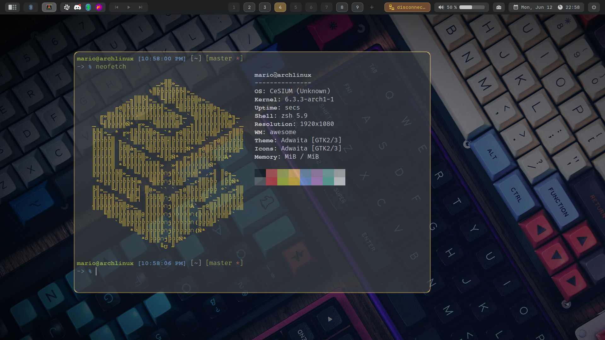
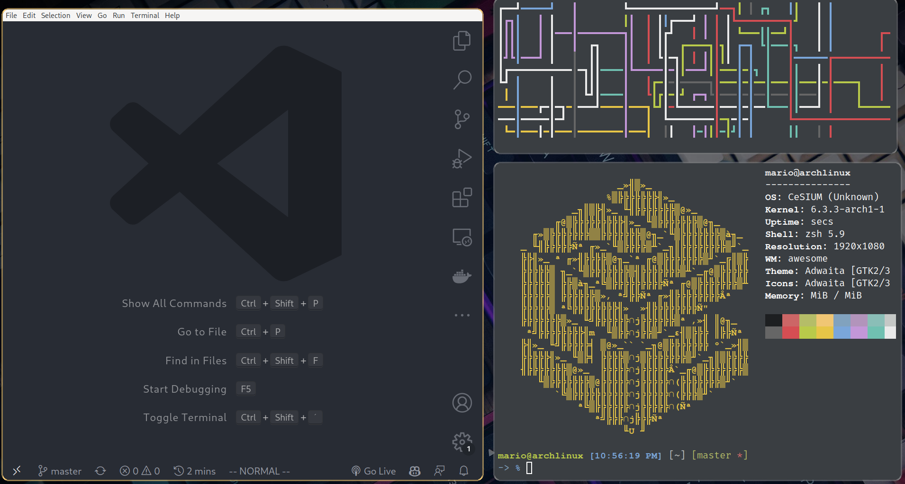

# ~/.dotfiles




## Some of the worthy tools that I use, develop or help maintain:

- awesome
- alacritty
- [vscode](https://github.com/i3/i3lock) (improved screen locker)
- [polybar](https://github.com/polybar/polybar) (A fast and easy-to-use status bar)
- [picom](https://github.com/yshui/picom) (A lightweight compositor for X11)
- [rofi](https://github.com/davatorium/rofi) (A window switcher, application launcher and dmenu replacement)
- [zsh](https://www.zsh.org) + [oh-my-zsh](https://github.com/ohmyzsh/ohmyzsh) + [zsh-syntax-highlighting](https://github.com/zsh-users/zsh-syntax-highlighting) (terminal sexy <39)


## How to use?

You need to install some packages that are dependencies for everything to work.
Do this preferably on some [**tty**](https://www.techwalla.com/articles/how-to-switch-tty)

[**Want to use Arch? Use my install script**](https://github.com/mamutal91/myarch)

```
$ sudo pacman -Sy git --noconfirm
$ git clone https://github.com/mariorodrigues10/dotfiles ~/.dotfiles
$ cd ~/.dotfiles
$ cp -r dotfiles/<folder> ~/.config/
```

# Shortcuts
#### Shortcuts to use

| Key1 | Key2 | Key3 | Description |
|--|--|--|--|
| Super | Enter | --- | Terminal |
| Super | Space | --- | Toggle Floating |
| Super | A | --- | Rofi |
| Super | F | --- | Fullscreen |
| Super | R | --- | Rename window |
| Super | K | --- | Close Window |
| Super | W | --- | Show client menu |
| Alt | Tab | --- | Client Switcher |
